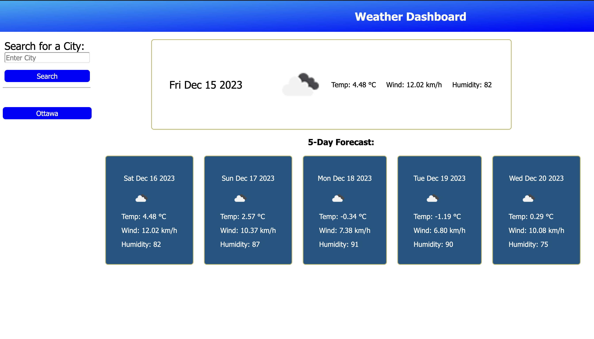

# City Forecast

## City Forecast Building

The purpose of this project is to create city forecaster. Developing this project demonstrates our server-side programming skills using third party APIs.
This project was developed with Open Weather Map API. The code needed retrieve the 5 day forecast of a typed in city. then stored locally, and demonstrate its storage through the history log. Then, a feature for a user to click the list item to revisit previous entries.  

The following is an image of the City Forecast application.
 

## Installation

N/A

## Usage

To use the forecast application, simply click the following link: https://gah-mewbittik.github.io/City-Forecast/
From there you will be able view the application and use it by simply clicking and typing the city into the input area. The application will display the current forecast, the 5-Day forecast, and display a history of city names that you can re-display its forecast.  

## Credits

N/A

## License

Please refer to the LICENSE in the repo.